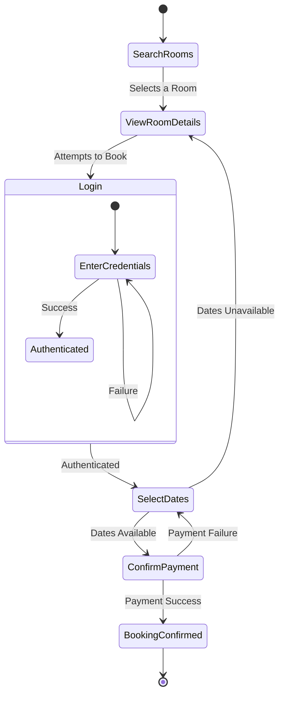
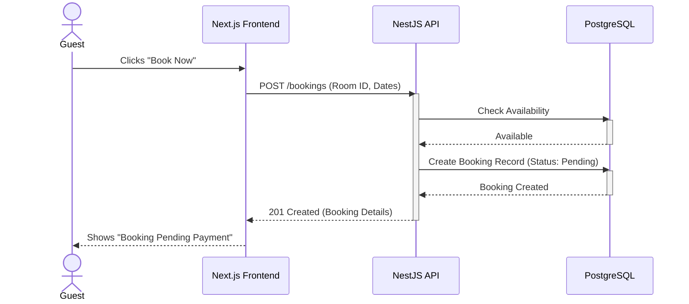
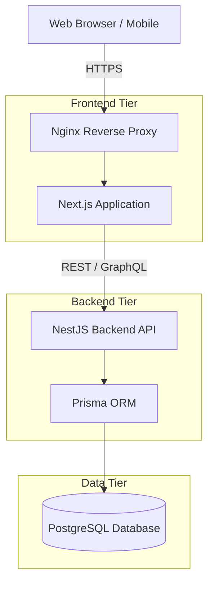
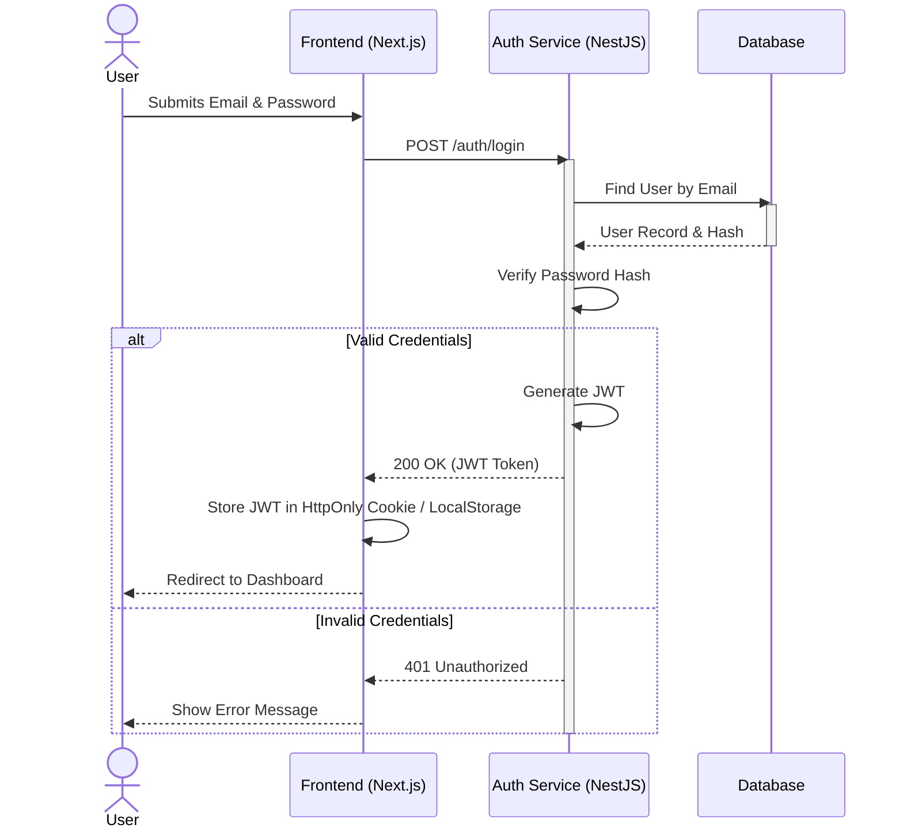

# Architecture Documentation

This document provides a comprehensive overview of the architecture, design, and requirements for the Room Rental Platform.

---

## 1. Functional Requirements

- **User Authentication:** Users can register, log in, and manage their profiles securely.
- **Room Listings:** Hosts can create, read, update, and delete room listings. Listings include descriptions, prices, images, and amenities.
- **Search & Filtering:** Guests can search for available rooms by location and filter by price range, dates, and amenities.
- **Booking Management:** Guests can request to book a room. Hosts can accept or decline booking requests.
- **Reviews & Ratings:** Guests can leave reviews and ratings for rooms they have stayed in.
- **Payment Processing:** (Placeholder) System handles secure payment transactions upon booking confirmation.

---

## 2. Non-Functional Requirements

- **Performance:** Fast initial page loads using Next.js Server-Side Rendering (SSR) and Static Site Generation (SSG). API response times should be under 200ms.
- **Scalability:** The NestJS backend must be stateless to allow horizontal scaling. The PostgreSQL database should support connection pooling.
- **Security:** Implement robust JWT-based authentication. All sensitive data (e.g., passwords) must be hashed using bcrypt. Validate all inputs to prevent SQL injection and XSS.
- **Availability:** Ensure 99.9% uptime by utilizing containerized deployments and health checks.

---

## 3. User Roles

| Role | Description |
| :--- | :--- |
| **Guest** | Can browse listings, search for rooms, make bookings, and leave reviews. |
| **Host** | Can create and manage room listings, view booking requests, and communicate with guests. |
| **Admin** | Has full access to the platform to manage users, resolve disputes, moderate listings, and view system analytics. |

---

## 4. Use Cases

### Guest Use Cases
1. Search for rooms by location and dates.
2. View detailed room information and availability.
3. Book a room and process payment.
4. Leave a review after the stay.

### Host Use Cases
1. Create a new room listing with photos and pricing.
2. Update existing room details or calendar availability.
3. Accept or reject incoming booking requests.
4. View earnings and upcoming reservations.

---

## 5. Activity Diagram

The following diagram illustrates the flow of a Guest searching for and booking a room.



---

## 6. Sequence Diagram

This diagram shows the interactions between the Guest, Frontend, Backend, and Database during a booking request.



---

## 7. System Architecture

The high-level system architecture follows a modern three-tier application model.



---

## 8. Authentication Flow

Authentication is handled via JSON Web Tokens (JWT). The diagram below outlines the login process.



---

## 9. Deployment Architecture

For local development and future staging/production, the application is containerized using Docker.


---

## 10. Folder Structure

The monorepo is structured to keep concerns separated while allowing shared tooling.

```text
room-rental/
├── .github/
│   └── workflows/
│       └── ci.yml             # Continuous Integration pipelines
├── backend/
│   ├── src/                   # NestJS source code (controllers, services, modules)
│   ├── test/                  # E2E and unit tests
│   ├── package.json
│   └── tsconfig.json
├── database/
│   ├── prisma/
│   │   ├── schema.prisma      # Prisma data model
│   │   └── migrations/        # Database migration files
│   └── package.json
├── docs/
│   └── architecture.md        # This documentation file
├── frontend/
│   ├── src/
│   │   ├── app/               # Next.js App Router pages
│   │   ├── components/        # Shadcn UI and custom components
│   │   ├── lib/               # Utility functions
│   │   └── styles/            # Tailwind CSS global styles
│   ├── package.json
│   └── tailwind.config.ts
├── docker-compose.yml         # Container orchestration
└── README.md                  # Project setup and commands
```
