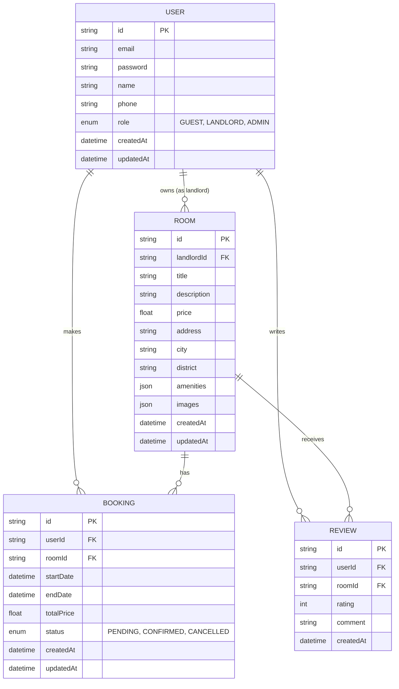

# Entity Relationship Diagram (ERD)

This document describes the database schema, entity relationships, and table structures for the Room Rental Platform.

## Complete ERD

## Database Relationships

1. **User and Room (One-to-Many):** A User (with role LANDLORD) can own multiple Rooms. A Room belongs to exactly one Landlord.
2. **User and Booking (One-to-Many):** A User (Guest) can make multiple Bookings. A Booking is made by exactly one User.
3. **Room and Booking (One-to-Many):** A Room can have multiple Bookings over time. A Booking is associated with exactly one Room.
4. **User and Review (One-to-Many):** A User can write multiple Reviews. A Review is written by exactly one User.
5. **Room and Review (One-to-Many):** A Room can receive multiple Reviews. A Review belongs to exactly one Room.

## Table Explanation

### `User` Table
Stores authentication and profile information for all types of users on the platform. The `role` column dictates what actions the user is authorized to perform (e.g., `GUEST` can book, `LANDLORD` can list rooms).

### `Room` Table
Stores details about rental listings. It links back to the `User` table via `landlordId`. It contains geographical information (`address`, `city`, `district`) for search functionality, and JSON fields for `amenities` and `images`.

### `Booking` Table
Manages the lifecycle of a reservation. It tracks which `User` booked which `Room`, for what dates, and the total cost. The `status` field tracks whether the booking is pending payment, confirmed, or cancelled.

### `Review` Table
Stores ratings and feedback left by guests. It links to both `User` (the reviewer) and `Room` (the subject of the review).
